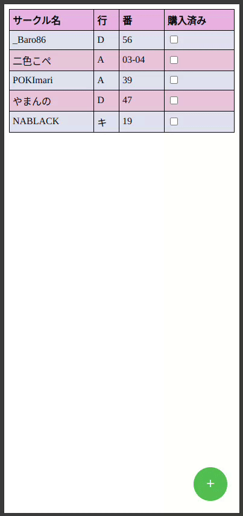

# Introduction

It is not uncommon that visitors aim to buy as much as they can in events, and it is always necessary for them to keep track of the purchase progress. Big events like Comiket allows visitors to save their targeted booths with functions of web catalog, enabling them to make a comprehensive preparation before events, as well as a better control during events.

However, smaller events like only-event do not have such resources to provide web support, and visitors need to use original and inconvenient methods like printing the venue map for them to refer to throughout the event.

In view of this, given that the Internet condition is good enough, this project allows visitors to achieve these objectives using their individual devices as a replacement of the official web catalog services. It also provides a route calculation function, helping users to figure out the shortest path to traverse all the interested booths.

This project uses にじそうさく09 as an example. The following are some available functions in this tool:


<div class="image-container" style="display: flex; justify-content: space-between;">
  <div class="image-item">
    
    <p style="font-size: 14px;
  line-height: 20px;
  margin-top: 5px;
  text-align: center;
  vertical-align: middle;">Add circles</p>
  </div>
  
  <div class="image-item">
    
    <p style="font-size: 14px;
  line-height: 20px;
  margin-top: 5px;
  text-align: center;
  vertical-align: middle;">Filter circles</p>
  </div>
  
  <div class="image-item">
    
    <p style="font-size: 14px;
  line-height: 20px;
  margin-top: 5px;
  text-align: center;
  vertical-align: middle;">Plot circles on map</p>
  </div>
</div>


# Instructions
This document records all the codes and information of this project through **setting up a local server**

```
git clone -b local https://github.com/garfieldtong/Event_tool.git
```

## Using venv as virtual environment
```
sudo apt install python3.10-venv
python3 -m venv "CMP"
cd CMP
source bin/activate
cd ~/Event_tool/everything_bug/code
pip3 install -r requirements.txt
```

## Activate server
```
fastapi run app/updated.py --host 127.0.0.1 --port 8000
```

## Using Docker for setup (optional)
```
docker build -t proj_test .
docker run -d --name proj_test -p 8000:8000 proj_test

docker ps -a

docker stop $(docker ps -a -q)
docker rm $(docker ps -a -q)

docker build -t proj_test .
docker run -d --name proj_test -p 8000:8000 proj_test

docker build -t proj_test:1.0.0 .
docker run -p 8000:8000 proj_test:1.0.0

docker image tag proj_test:1.0.0 c8n.io/garfieldcm385/proj_test

docker push c8n.io/garfieldcm385/proj_test
```


