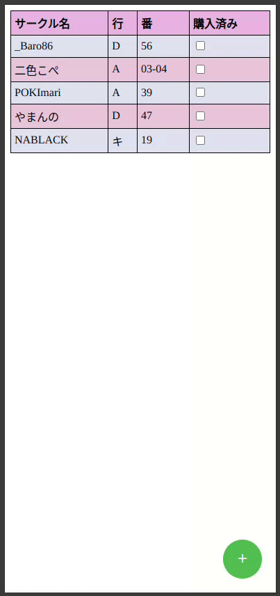

# Introduction

このプロジェクトは、同人イベントの来場者が購入進捗を把握できるようにするためのツールを提供します。小規模なイベントでは、ウェブカタログのような便利な機能を提供する余裕がありません。そのため、来場者は会場の地図を印刷して持参するなど、独自の不便な方法に頼らざるを得ないのが現状です。

したがって、このツールは来場者にとって非常に便利です。良好なインターネット環境が整っている場合、自分のデバイスを使用して、公式のウェブカタログサービスの代わりに必要な機能を利用できるように設計されています。このように、来場者は印刷された地図を持ち歩く必要がなく、スマートフォンやタブレットなどのデバイスを使用して、より便利にイベントを楽しむことができます。

今回のプロジェクトでは、にじそうさく09を例として挙げています。


機能概要

    サークルの追加: 来場者は興味のあるサークルを事前に保存し、イベント中に簡単にアクセスできるようにします。
    ルート計算機能: 興味のあるすべてのサークルを効率的に回るための最短ルートを計算し、マップ上にサークルの位置と経路を表示します。


<div class="image-container" style="display: flex; justify-content: space-between;">
  <div class="image-item">
    
    <p style="font-size: 14px;
  line-height: 20px;
  margin-top: 5px;
  text-align: center;
  vertical-align: middle;">サークルの追加</p>
  </div>
  
  <div class="image-item">
    
    <p style="font-size: 14px;
  line-height: 20px;
  margin-top: 5px;
  text-align: center;
  vertical-align: middle;">サークルの絞り込み</p>
  </div>
  
  <div class="image-item">
    
    <p style="font-size: 14px;
  line-height: 20px;
  margin-top: 5px;
  text-align: center;
  vertical-align: middle;">マップ表示</p>
  </div>
</div>


# インストール
## 1. リポジトリをクローンする
```
git clone -b local https://github.com/garfieldtong/Event_tool.git
```

## 2. Pythonの仮想環境作成

venv または conda　のいずれかを使用します。

**venv:**
```
sudo apt install python3.10-venv
python3 -m venv "CMP"
cd CMP
source bin/activate
cd Event_tool/code
pip3 install -r requirements.txt
```

**conda:**
```
conda create -n CMP python=3.10
conda activate CMP
cd Event_tool/code
pip install -r requirements.txt
```

## 3. サーバー構築
```
fastapi run app/updated.py --host 127.0.0.1 --port 8000
```

## 4. Event_tool/phone/new_web.htmlでサイトを起動
このツールはモバイル端末向けに最適化されています。パソコンでご利用の場合は、ブラウザの開発者ツールを使って携帯表示モードに切り替えることをおすすめします。<br>
切り替え方法は以下の通りです：<br>
1.ブラウザの開発者ツールを開く（F12キーを押す）<br>
2.'Toggle device toolbar'を選択する（または Ctrl+Shift+M を押す）
